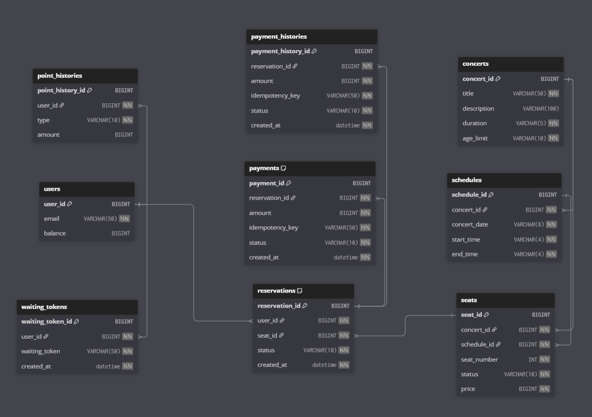

### 도메인별 Entity

#### users (사용자)
|key|필드|설명|타입|비고|
|---|---|---|---|---|
|PK|userId|사용자 ID|Long|AUTO_INCREMENT|
|-|email|이메일|String|NOT NULL|
|-|balance|잔액|Long|NOT NULL|

#### pointHistories (포인트이력)
|key|필드|설명|타입|비고|
|---|---|---|---|---|
|PK|pointHistoryId|포인트이력 ID|Long|AUTO_INCREMENT|
|FK|userId|유저 ID|Long|NOT NULL|
|-|type|사용/충전 상태|ENUM|`USE`, `CHARGE`|
|-|amount|요청 금액|Long|NOT NULL|

#### concerts (콘서트)
|key|필드|설명|타입|비고|
|---|---|---|---|---|
|PK|concertId|콘서트 ID|Long|AUTO_INCREMENT|
|-|title|제목|String|NOT NULL|
|-|description|설명|String||
|-|ageLimitStatus|나이 제한|ENUM|`12`, `15`, `19`, `ALL`|

#### schedules (스케쥴)
|key|필드|설명|타입|비고|
|---|---|---|---|---|
|PK|scheduleId|스케쥴 ID|Long|AUTO_INCREMENT|
|FK|concertId|콘서트 ID|Long|NOT NULL|
|-|basePrice|기본 가격|Long|NOT NULL|
|-|concertDate|콘서트 날짜|String|NOT NULL|
|-|startTime|시작 시간|String|NOT NULL|
|-|endTime|종료 시간|String|NOT NULL|

#### seats (좌석)
|key|필드|설명|타입|비고|
|---|---|---|---|---|
|PK|seatId|좌석 ID|Long|AUTO_INCREMENT|
|FK|concertId|콘서트 ID|Long|NOT NULL|
|FK|scheduleId|스케쥴 ID|Long|NOT NULL|
|-|seatNumber|좌석 번호|Int|NOT NULL|
|-|status|좌석 상태|ENUM|`AVAILABLE`, `HELD`|
|-|price|좌석 가격|Long|NOT NULL|

#### reservations (예약)
|key|필드|설명|타입|비고|
|---|---|---|---|---|
|PK|reservationId|예약 ID|Long|AUTO_INCREMENT|
|FK|userId|사용자 ID|Long|NOT NULL|
|FK|seatId|좌석 ID|Long|NOT NULL|
|-|status|예약 상태|ENUM|`PENDING`, `CONFIRMED`, `EXPIRED`|
|-|createdAt|예약 생성일시|LocalDateTime|NOT NULL|

#### waitingTokens (대기열 토큰)
|key|필드|설명|타입|비고|
|---|---|---|---|---|
|PK|waitingTokenId|대기열 토큰 ID|Long|AUTO_INCREMENT|
|FK|userId|사용자 ID|Long|NOT NULL|
|-|status|대기열 상태|ENUM|`WAITING`, `HELD`, `EXPIRED`|
|-|waitingToken|대기열 토큰|String|NOT NULL|
|-|createdAt|토큰 생성일시|LocalDateTime|NOT NULL|
|-|expiredAt|토큰 만료일시|LocalDateTime|NOT NULL|

#### payments (결제)
|key|필드|설명|타입|비고|
|---|---|---|---|---|
|PK|paymentId|결제 ID|Long|AUTO_INCREMENT|
|FK|reservationId|예약 ID|Long|NOT NULL|
|-|amount|금액|Long|NOT NULL|
|-|idempotencyKey|멱등성 키|String||
|-|status|결제 상태|ENUM|`WAITING`, `PAID`|
|-|createdAt|결제 생성일시|LocalDateTime|NOT NULL|

> unique key('reservation_id', 'idempotency_key')

#### paymentHistories (결제이력)
|key|필드|설명|타입|비고|
|---|---|---|---|---|
|PK|paymentHistoryId|결제 ID|Long|AUTO_INCREMENT|
|FK|reservationId|예약 ID|Long|NOT NULL|
|-|amount|금액|Long|NOT NULL|
|-|idempotencyKey|멱등성 키|String|NOT NULL|
|-|status|결제 상태|ENUM|`WAITING`, `PAID`|
|-|createdAt|결제 생성일시|LocalDateTime|NOT NULL|

### 데이터 모델링 원칙
- 테이블 명은 복수형을 사용하며 `snake_case`를 사용한다.
- 각 테이블의 pk는 모두 `{테이블 단수명}_id`이며 `AUTO_INCREMENT` 전략을 사용한다.
- FK 설정
  - 자식 테이블이 FK를 가지도록 한다.
  -  `ON DELETE CASCADE`와 `ON UPDATE CASCADE`를 사용하여 부모가 삭제되는 경우, 자식에도 연쇄 적용이 되도록 한다.
- 도메인 별로 엔티티를 독립시킨다.
- ENUM의 경우 맨 뒤에 `status`를 추가한다.

### 도메인 경계 및 관계설정 의도
- 도메인은 크게 사용자, 콘서트 정보, 예매 3개로 구분한다.

#### 사용자
- `users`와 `point_histories`의 관계는 `1 : N`  -> 사용자가 포인트를 충전하거나 사용할 때마다 이력이 쌓인다.
- `users`와 `waiting_tokens`의 관계는 `1 : N`  -> 사용자가 토큰을 발급 받을 때마다 토큰이 쌓인다.
  - 최근에 발급받은 토큰을 조회하기 위해 쿼리문이 복잡해지지만, 토큰을 update할 때 발생하는 락을 방지

#### 콘서트 정보
- `concerts`와 `schedules`의 관계는 `1:N` -> 콘서트는 여러개의 스케쥴을 가진다.
- `schedules`와 `seats`의 관계는 `1:N` -> 1개의 스케쥴 당 50개의 좌석을 가진다.
  - `seats`에 `concert_id`를 중복 허용하는 비정규화를 통해 조회 성능 개선
    
#### 예약
- `reservations`와 `payment`의 관계는 `1:1` -> 예약된 자석은 1번만 결제가 가능하다.
  - 취소 기능이 생긴다면, `status`를 활용해 `1:N` 으로 확장을 고려
-  `reservations`은  `users`와 `seats`의 중간 테이블이 아닌 행위 테이블
  - `users`와 `seats`는 `1:N`이지만 `seats`는 자원을 관리하는 테이블이므로 `user_id`를 가지지 않는다.
  - `seats`에 `user_id`가 있으면 예약 시, 취소 시마다 계속 update하는 불편함도 있다.
- `seats`와 `reservations`의 관계는 `1:N` -> 시간이 지남에 따라 특정 좌석은 다른 사람이 예약 할 수 있다.
- `payments`와 `payment_histories`의 관계는 `1:N` -> 결제의 상태가 변할 때마다 이력이 쌓인다.

### 제약
- `payments`의 중복 결제를 방지하기 위해 `(reservation_id, idempotency_key)`는  `unique` 상태를 유지해야한다.
