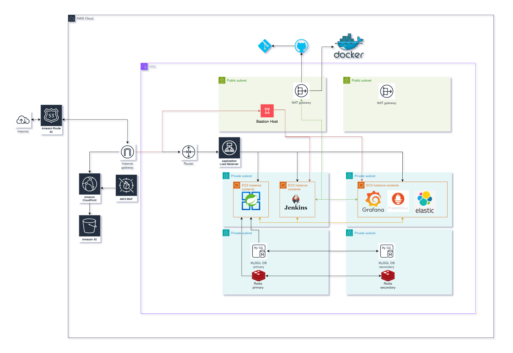

## 인프라

| 구분 | Spring Boot EC2 | RDS 구성 | NAT Gateway | ALB 사용 | 장애 대응 능력 | 비용 수준 | 추천 용도 | 특징 요약 |
|------|------------------|-----------|--------------|-----------|----------------|-------------|-------------|-------------|
| **1️⃣ 비용 절감 + 안정성 밸런스 (추천)** | 1대 (AZ A) | ✅ Multi-AZ (A/B) | 1개 (AZ A만) | ❌ 없음 | AZ A 장애 시 Spring Boot만 중단, 나머지는 정상 | 💰 중간 | 테스트 + 소규모 실서비스 | 비용 절감하면서도 DB 안정성 확보, 모니터링은 다른 AZ에서 지속 가능 |
| **2️⃣ 안정성 밸런스 (운영 직전 단계)** | 2대 (AZ A, B) | ✅ Multi-AZ (A/B) | 2개 (A/B 각각) | ✅ 있음 (트래픽 분산) | 무중단 또는 거의 무중단 | 💸💸 높음 | 운영/프로덕션 | 완전한 이중화, 장애 시에도 서비스 유지, ALB를 통한 자동 트래픽 분산 |
| **3️⃣ 비용 절감형 (개발용)** | 1대 (AZ A) | ❌ 단일 AZ | 1개 (AZ A만) | ❌ 없음 | AZ A 장애 시 전체 중단 | 💸 낮음 | 개발/PoC 전용 | 가장 저렴하지만 장애 시 서비스 전체 중단, 테스트용으로 적합 |

#### 인프라 구성 의도
#### vpc 외부
- 도메인을 관리할 `Route 53`과 올바르지 않은 요청을 제어할 방화벽 `WAF`을 구성합니다
- 정적 자원을 캐싱할 수 있도록 `CloudFront`와 `S3` 버킷을 구성합니다
- 가상 네트워크 환경의 `VPC`를 구성하고 `Internet Gateway`를 두어 인터넷의 출입문으로 활용합니다

#### 라우팅
- `public subnet`과 `private subnet`을 각각 2개씩 구성하여 고가용성을 높이고 `private subnet`에 직접접근을 제한합니다
- `VPC`에 진입한 요청을 올바른 subnet의 서비스로 전달하기 위해 `Router`와 `ALB`를 구성합니다

#### public subnet
- 외부에서 `private subnet`에 접근을 위해 `bastion host`를 구성합니다
- `private subnet`에서 외부로 인터넷 연결을 위해 `public subnet`에 `NAT Gateway`를 구성합니다
- `NAT Gateway`를 통해 외부의 `Github`, `Git`, `DockerHub`와 통신합니다

#### private subnet
- AZ1에는 백엔드 서버(`Spring Boot`)와 `Jenkins`를, AZ2에는 기타 서비스(`Grafana`, `Prometheus`, `elastic`) 를 구성합니다
  - 고가용성을 위해 `Spring Boot` 서버를 각 AZ에 분리하면 좋지만 테스트 프로젝트로 AZ1에만 구성합니다
- DB는 `MySQL`로 구성하며 `primary`와 `secondary`를 각 AZ에 분리합니다(`Redis` 동일)
  - AZ1이 다운되면 AZ2가 `primary`로 승격되도록 고가용성을 확보합니다

### 인터넷 접근 관련 구성
#### 사용서비스
- `Route 53`, `CloudFront`, `S3`, `WAF`, `Internet Gateway`
#### 흐름도
1. `Route 53`(DNS 라우팅): 사용자가 URL에 접속하면 CloudFront 배포의 도메인으로 라우팅
2. `CloudFront`(CDN 및 글로벗 엣지 캐시): 전 세계 엣지 로케이션에서 사용자와 가장 가까운 노드가 요청 수신
3. `WAF`(웹 공격방어 계층): 요청을 검사하여 CloudFront가 오리진에 도달하기 전에 차단
4. `S3`(정적 콘텐츠 저장소): CloudFront 요청으로 S3 버킷의 객체를 응답
5. `Internet Gateway`-`VPC 내부`-`Private Subnet`으로 요청 처리
6. `CloudFront Cache` 응답: S3에서 가져온 코넨츠를 엣지 캐시에 저장, 동일 요청을 캐시가 응답
