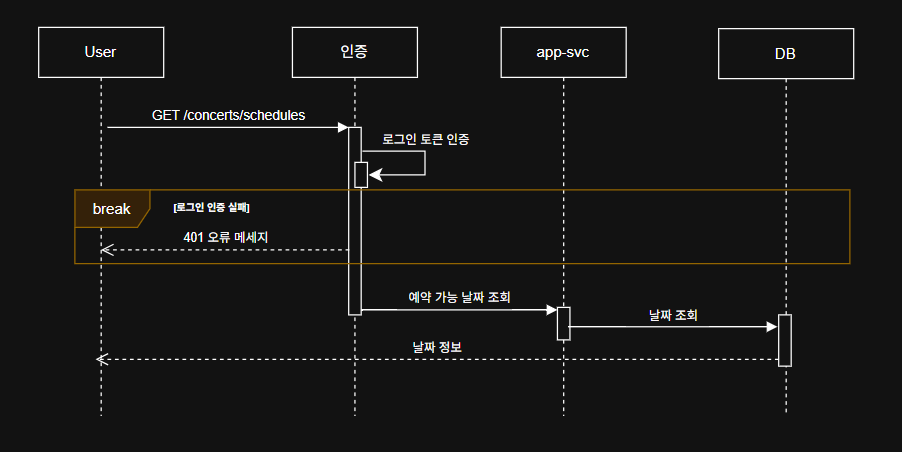
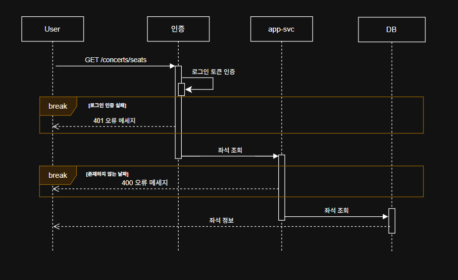
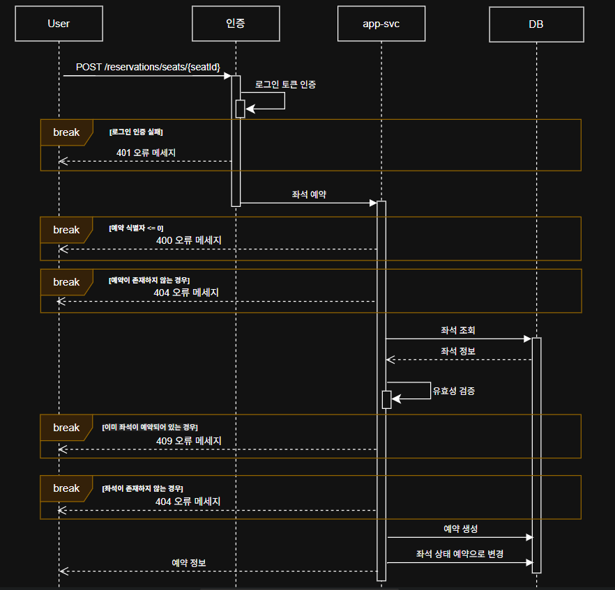
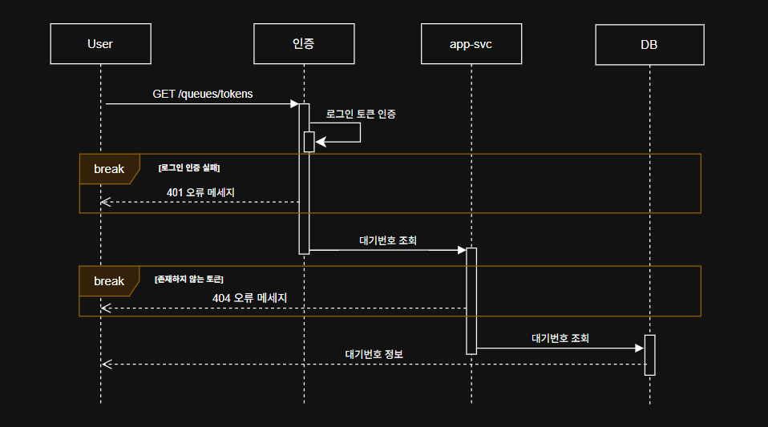
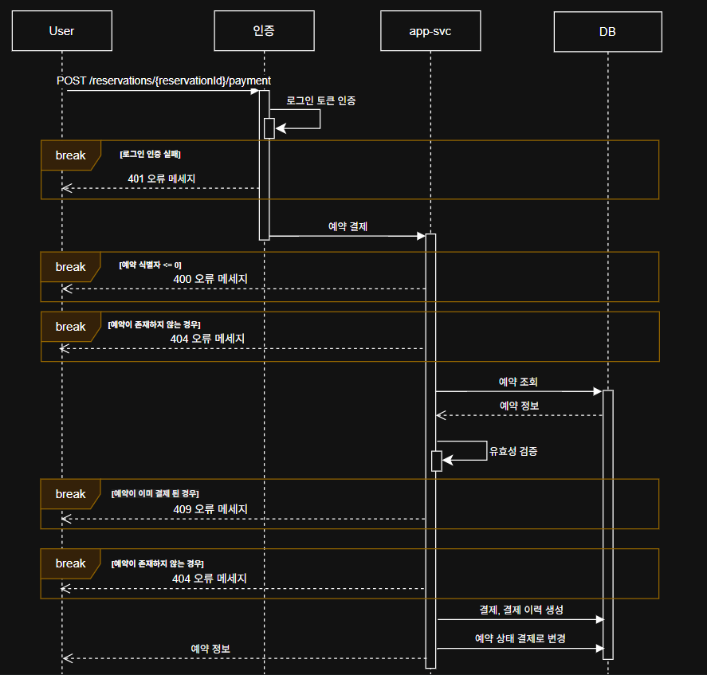
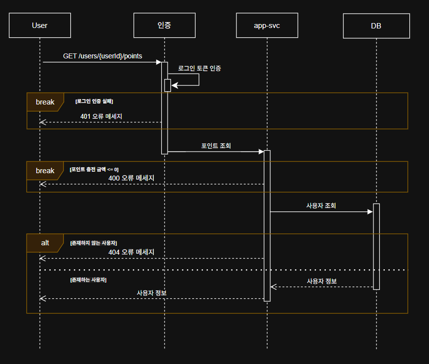
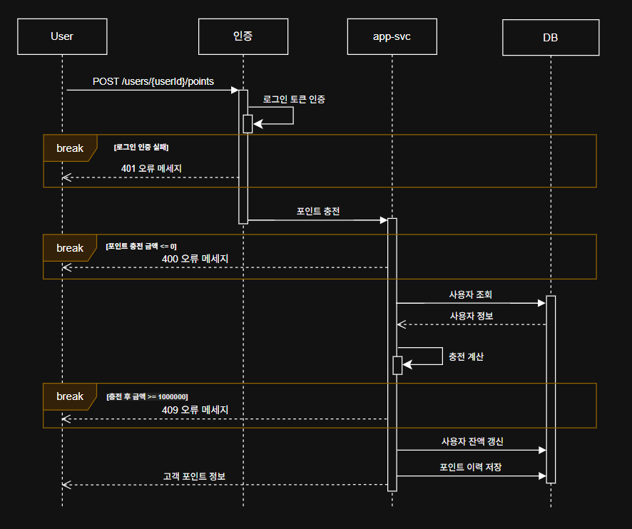

## 시퀀스 다이어그램

### 기본사항
- 모든 API는 로그인 토큰 검사를 해야하며 대기열을 확인해야 한다
  - 인증검사는 중요하므로 액터로 분리한다
- 어플리케이션은 `app-svc`로 통합하여 표현하며 `DB`는 별도로 분리한다

### 콘서트 (concerts)

#### 콘서트 날짜 목록 조회

#### 콘서트 좌석 목록 조회

#### 콘서트 좌석 예약

### 대기열 (queues)

#### 대기열 토큰 발급

#### 대기번호 조회

### 예약 (reservations)

#### 예약 결제

### 사용자 (users)

#### 포인트 조회

#### 포인트 충전

